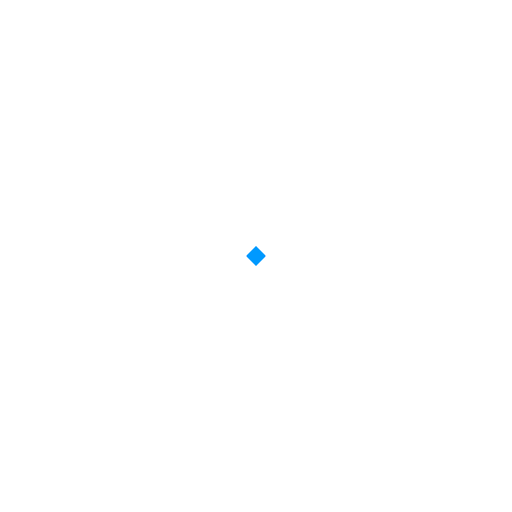

<p align="center">
  
</p>

# Keepframe

Keepframe measures a flat 2D motion-graphics clip or UI screen recording into an editable scene and renders MP4. You name what to keep and what to change. Live-action is rejected.

## Requirements

- Python 3.11+ (3.12 for `[ocr]`; RapidOCR stops at 3.12)
- [ffmpeg](https://ffmpeg.org/) on `PATH`
- Chromium via Playwright, for compose and render

## Install

```bash
python3 -m venv .venv
source .venv/bin/activate
pip install '.[ocr]'
playwright install chromium
```

`pip install .` skips OCR. GPU refine: `pip install '.[gpu]'`.
NVIDIA OCR needs `[ocr]` plus a CUDA 12 `onnxruntime-gpu` wheel (`<1.27`; 1.27+ is CUDA 13). Uninstall **both** ORT packages or a leftover CPU wheel breaks `GraphOptimizationLevel`. Do not run `pip install '.[ocr]'` again afterwards (it pulls CPU `onnxruntime` back).

```bash
pip install -e '.[ocr]'
pip uninstall -y onnxruntime onnxruntime-gpu
pip install 'onnxruntime-gpu>=1.19,<1.27'
python -c "import torch; from onnxruntime import GraphOptimizationLevel, get_available_providers, get_device; print(get_device(), get_available_providers())"
python -c "import torch; from rapidocr_onnxruntime import RapidOCR; print('ocr ok')"
```

## Usage

```bash
keepframe serve --workspace ./data/workspace
```

http://127.0.0.1:8765/ landing. Maker UI at `/library` and `/new` (Korean by default; header toggle for English). `/demo` seeds a synthetic sample and opens review — no upload or analysis.

```bash
keepframe analyze --video ref.mp4 --start 0 --end 90 --out ./out
keepframe compose --scene ./out/scenes/s1/scene.json --out ./out/comp.html
keepframe render --scene ./out/scenes/s1/scene.json --html ./out/comp.html --out ./out/frames --mp4
keepframe verify --scene ./out/scenes/s1/scene.json --render-json ./out/frames/render.json
keepframe correct --root ./out --scene s1 --op text --args '{"element_id":"e3","text":"New title"}'
```

`--end` is inclusive. `correct` ops: `reassign`, `mask`, `bbox`, `text`.

## CLI

| Command | Role |
| --- | --- |
| `serve` | Maker UI. `--admin` mounts `/admin` |
| `analyze` | Video to IR |
| `compose` | Scene JSON to HTML + GSAP |
| `render` | Chromium frames, optional MP4 |
| `verify` | Schema, keep predicates, frame compare |
| `correct` | Review ops on a scene |
| `synth` | Synthetic scene |
| `gate-m1` / `gate-m2` | Synthetic gates |

## Docker

```bash
cp .env.example .env
docker compose up -d
```

Image `westernbear/keepframe:0.1.0` (`KEEPFRAME_IMAGE` / `KEEPFRAME_TAG`). Port 8765. Volume `./data/workspace`. Analyze and render run in-process (`KEEPFRAME_JOB_RUNNER=thread`).

```bash
docker compose --profile admin up -d
```

GPU refine needs an NVIDIA GPU, the NVIDIA Container Toolkit, and the `gpu` image layer.
Intel iGPU is not used. The overlay sets `KEEPFRAME_DEVICE=cuda` so sprite refine will not silently fall back to CPU.

```bash
docker compose -f docker-compose.yml -f docker-compose.gpu.yml up -d --build
```

## Limits

- Flat 2D motion graphics and UI recordings only
- Keep predicates required on every edit
- Repair retries: 4. Asset generation: 2. Caps are display-only
