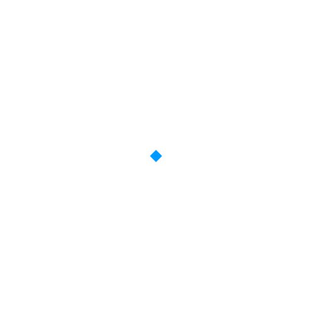

<p align="center">
  
</p>

# Keepframe

Keepframe measures a flat 2D motion-graphics clip or UI screen recording into an editable scene and renders MP4. You name what to keep and what to change. Live-action is rejected.

## Requirements

- Python 3.11+ (3.12 for `[ocr]`; RapidOCR stops at 3.12)
- [ffmpeg](https://ffmpeg.org/) on `PATH`
- Chromium via Playwright, for compose and render

## Install

```bash
python3 -m venv .venv
source .venv/bin/activate
pip install '.[ocr]'
playwright install chromium
```

`pip install .` skips OCR. GPU refine: `pip install '.[gpu]'`.
NVIDIA OCR needs `[ocr]` plus a CUDA 12 `onnxruntime-gpu` wheel (`<1.27`; 1.27+ is CUDA 13). Uninstall **both** ORT packages or a leftover CPU wheel breaks `GraphOptimizationLevel`. Do not run `pip install '.[ocr]'` again afterwards (it pulls CPU `onnxruntime` back).

```bash
pip install -e '.[ocr]'
pip uninstall -y onnxruntime onnxruntime-gpu
pip install 'onnxruntime-gpu>=1.19,<1.27'
python -c "import torch; from onnxruntime import GraphOptimizationLevel, get_available_providers, get_device; print(get_device(), get_available_providers())"
python -c "import torch; from rapidocr_onnxruntime import RapidOCR; print('ocr ok')"
```

## Usage

```bash
keepframe serve --workspace ./data/workspace
```

http://127.0.0.1:8765/ landing. Maker UI at `/library` and `/new` (Korean by default; header toggle for English). `/demo` seeds a synthetic sample and opens review — no upload or analysis. `/admin` is on by default and requires an explicitly configured account; set `KEEPFRAME_ADMIN_EMAIL` and `KEEPFRAME_ADMIN_PASSWORD` (or `KEEPFRAME_ADMIN_USERS` as comma-separated `email:password` pairs). `--no-admin` turns it off.

CLI-generated project directories placed under the workspace appear in the library even without `meta.json`; the first metadata change creates that file. Analysis creates `overrides.json` without overwriting existing overrides, and frame-stage reruns reuse the recorded source range.

The optional After Effects relay is a second, connector-only listener. Set
`KEEPFRAME_AE_RELAY_URL`, `KEEPFRAME_AE_RELAY_HOST`,
`KEEPFRAME_AE_RELAY_PORT`, and `KEEPFRAME_AE_RELAY_TOKEN` together; partial
configuration fails startup. Expose only that relay listener through an HTTPS
reverse proxy. Plain HTTP relay URLs are accepted only for loopback hosts.

The first same-origin pairing establishes a project-scoped, host-only controller
cookie. Re-pairing and unpairing require that cookie. Replacement and unpair
stop new connector leases, allow the active lease to settle, then rotate or
revoke the hashed device credential. Browser artifact downloads require the
same controller cookie and same-origin request.

Install the optional Windows connector with `pip install 'keepframe[ae]'`.
`keepframe ae-install [--ae-path ...]` installs the ScriptUI panel for After
Effects 2022 or newer; restart After Effects, enable **Allow Scripts to Write
Files and Access Network**, then open **Window > Keepframe Panel**. With
`KEEPFRAME_AE_RELAY_TOKEN` set only in the connector environment, run
`keepframe ae-connect --url https://relay.example`; the command prompts for the
one-use pairing code without echoing it. Later starts use
`keepframe ae-connect --url https://relay.example --project PROJECT_ID` and the
current-user DPAPI-protected device record. The MCP child receives neither
relay credential.

After Effects plans pin the active capability manifest, operation schemas, scene
assets, source locks, and any acknowledged compatibility substitutions.
Unsupported fonts or converter semantics produce a non-approvable draft until
the proposed lost semantics are acknowledged; capability changes require a new
successor plan.

The five admin pages share the Korean/English toggle. Entity values and timestamps stay verbatim. The admin queue combines seeded examples with live jobs from the running server; its status and GPU counts reflect those rows.

```bash
keepframe analyze --video ref.mp4 --start 0 --end 90 --out ./out
keepframe compose --scene ./out/scenes/s1/scene.json --out ./out/comp.html
keepframe render --scene ./out/scenes/s1/scene.json --html ./out/comp.html --out ./out/frames --mp4
keepframe verify --scene ./out/scenes/s1/scene.json --render-json ./out/frames/render.json
keepframe correct --root ./out --scene s1 --op text --args '{"element_id":"e3","text":"New title"}'
```

`--end` is inclusive. `correct` ops: `reassign`, `mask`, `bbox`, `text`.

## CLI

| Command | Role |
| --- | --- |
| `serve` | Maker UI. `/admin` on by default; `--no-admin` turns it off |
| `analyze` | Video to IR |
| `compose` | Scene JSON to HTML + GSAP |
| `render` | Chromium frames, optional MP4 |
| `verify` | Schema, keep predicates, frame compare |
| `correct` | Review ops on a scene |
| `ae-install` | Windows-only After Effects ScriptUI panel installer |
| `ae-connect` | Pair or resume the Windows connector and local MCP bridge |
| `synth` | Synthetic scene |
| `gate-m1` / `gate-m2` | Synthetic gates |

## Docker

```bash
cp .env.example .env
docker compose up -d
```

Image `westernbear/keepframe:0.1.0` (`KEEPFRAME_IMAGE` / `KEEPFRAME_TAG`). Port 8765. Volume `./data/workspace`. Analyze and render run in-process (`KEEPFRAME_JOB_RUNNER=thread`).

```bash
docker compose --profile admin up -d
```

GPU refine needs an NVIDIA GPU, the NVIDIA Container Toolkit, and the `gpu` image layer.
Intel iGPU is not used. The overlay sets `KEEPFRAME_DEVICE=cuda` so sprite refine will not silently fall back to CPU.

```bash
docker compose -f docker-compose.yml -f docker-compose.gpu.yml up -d --build
```

## Limits

- Flat 2D motion graphics and UI recordings only
- Keep predicates required on every edit
- Repair retries: 4. Asset generation: 2. Caps are display-only
