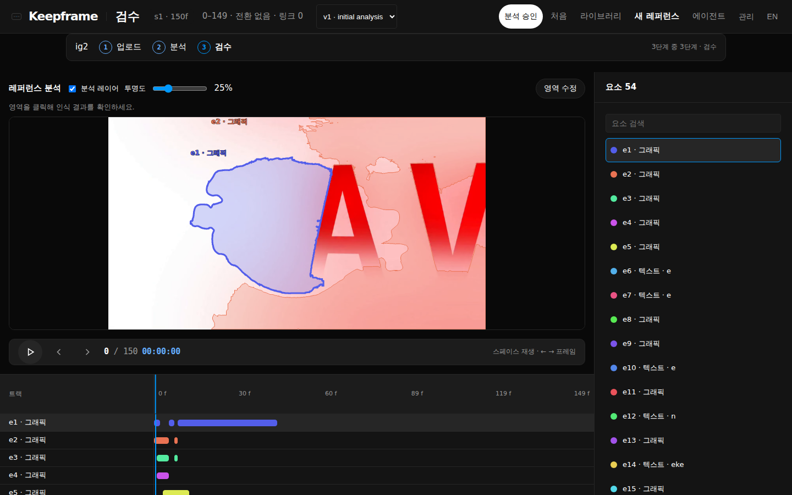
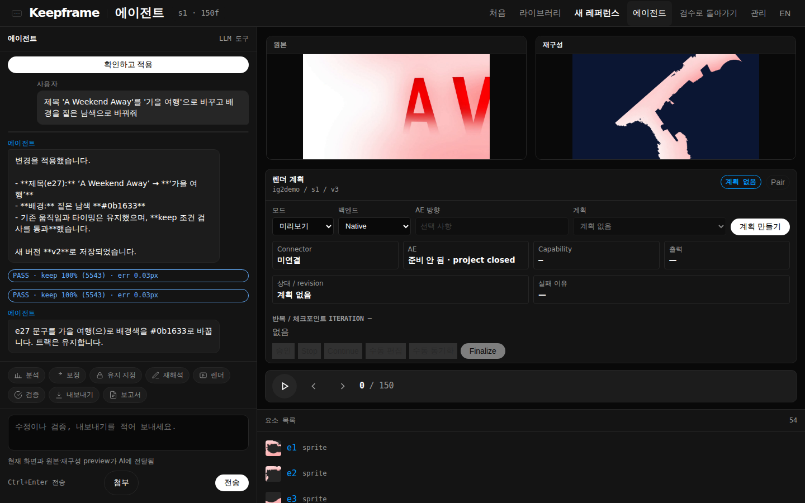

# Core-flow evaluation

Run `keepframe gate-m2-real --clips eval/clips --out eval/out/<name> --max-frames 150`, replacing `<name>` with the evaluation run name.

Baseline (2026-10-03, commit 6b5732f, CPU only — no GPU/torch so sprite refine skipped, RapidOCR on CPU):

| clip | size | frames | live_action | elements | kinds | mean_l1 | low_conf | keep_on/constraints | seconds | messages |
| --- | --- | --- | --- | --- | --- | --- | --- | --- | --- | --- |
| envato1 | 2560×1440 @59.94 | 150 | — | 67 | text 40, sprite 27 | 0.0848 | 55 | 0/7327 | 1412 | — |
| ig1 | 1916×1080 @30 | 150 | — | 103 | text 76, sprite 27 | 0.0597 | 80 | 0/36155 | 1616 | — |
| ig2 | 1920×1080 @60 | 150 | — | 46 | text 38, sprite 8 | 0.0798 | 36 | 0/3208 | 1405 | — |
| ig3 | 1920×1080 @30 | 150 | — | 84 | text 33, sprite 51 | 0.0176 | 39 | 0/10878 | 630 | — |

Clips: envato1 is a watermarked Envato preview ("Build" kinetic type over a dark purple gradient); ig1–ig3 are Instagram reels (kinetic typography over gradient/white backgrounds, ig2 a globe with a moving label). Clips live in `eval/clips/` and are not committed.

Observations:
- Fragmentation dominates: a few words become 33–76 text tracks and 8–51 sprites; most elements score below 0.7 confidence.
- Predicate explosion: 3k–36k predicates per 5 s window, none kept (keep defaulted off before Task 2).
- Only ig3 (white background, solid type) meets the M2 reconstruction target (mean L1 ≤ 0.02); gradient backgrounds (envato1, ig1, ig2) are 3–4× worse.
- Cost: 10–27 min per 150 frames on 4 CPU cores (OCR every frame ≈ 7 min at 2560×1440; ECC sprite fitting ≈ 6 min).

## Final (commit 938fdb0 analysis code + live VLM captions gpt-6.1-sol)

| clip | size | frames | live_action | elements | kinds | mean_l1 | low_conf | keep_on/constraints | seconds | messages |
| --- | --- | --- | --- | --- | --- | --- | --- | --- | --- | --- |
| envato1 | 2560×1440 @59.94 | 150 | — | 56 | sprite 47, text 9 | 0.0750 | 43 | 4734/4744 | 1868 | text tracks reclassified as shapes: 31 |
| ig1 | 1916×1080 @30 | 150 | — | 128 | sprite 84, text 44 | 0.0393 | 86 | 55444/55484 | 1645 | text tracks reclassified as shapes: 32 |
| ig2 | 1920×1080 @60 | 150 | — | 54 | sprite 39, text 15 | 0.0644 | 47 | 5543/5549 | 1229 | text tracks reclassified as shapes: 23 |
| ig3 | 1920×1080 @30 | 150 | — | 71 | sprite 61, text 10 | 0.0175 | 38 | 6443/6443 | 549 | text tracks reclassified as shapes: 23 |

Synthetic `gate-m2` (n=20, no torch): frame_l1_ok 18/20, tracking ok, temporal 0.789, passed. Gate result unchanged from pre-Phase-D (temporal 0.791).

## Phase D adoption

| Task | Decision | Evidence |
| --- | --- | --- |
| 15 — background plate | Adopted | mean_l1 −15…−32% on gradient clips |
| 16 — region merge | Adopted | Fewer elements on all four clips. envato1 regressed vs Task 15 (0.0580 → 0.0750), still below baseline (0.0848) |
| 17 — occlusion | REVERTED (`938fdb0`) | ig2 mean_l1 0.0644 without vs 0.0729 with; no element reduction |
| 20 — OCR noise → shapes | Adopted after reclassification | First version dropped tracks and failed criteria. Reclassification preserves their pixels as sprites |
| 18 — font candidates | No metric effect | Texture crops drive reconstruction. Large-headline fix: `5356cf9` |

## Prompt evaluation

`scripts/eval_prompts.py`, `gpt-6.1-sol`, preview-only. All ok rows have typed targets.

| clip | ok / prompts |
| --- | --- |
| ig3 | 3/8 |
| ig2 | 7/8 |
| envato1 | 6/8 |
| ig1 | 6/8 |
| Total | 22/32 |

- Target: at least 6/8 per clip. ig3 misses it.
- Logo prompt fails everywhere: no clip has a logo. The agent asks for clarification — correct.
- ig3 title prompts fail: its letter-by-letter reveal fragments the headline ("You just", "ust", "st"). The agent asks which fragment to edit.
- For background/timing, the model first put the scene id `s1` in `element`, then self-corrected after validation. Task 23 added schema descriptions.

## Browser E2E (ig2)

Review → approve → agent request: "제목 'A Weekend Away'를 '가을 여행'으로 바꾸고 배경을 짙은 남색으로" → confirm in the browser → PASS · keep 100% (5543) · err 0.03 px → native render.

Render: H.264, 1920×1080, 150 frames, 2.5 s. "가을 여행" renders without tofu on #0b1633; motion is kept. Review shows keep presets; the font picker is hidden when there are no candidates.

Visible fidelity limits: the globe is rebuilt as flat white fragments. Letter reveal leaves partial glyph sprites.

## Bugs found and fixed

| Finding from real clips | Fix |
| --- | --- |
| Temporal gate failed every edit on fragmented scenes | Task 22: compare motion by element ID; exclude tracks without motion evidence |
| ChatGPT provider broken for current models | Task 21: direct Responses client; default `gpt-6.1-sol` |
| Font candidates skipped headlines >256 px | Task 18 follow-up (`5356cf9`): render at a capped size for ranking |
| Edit tool executed without user confirmation | Task 23: agent tool previews only; execution requires browser confirmation |

## Known limits / next

- Predicate explosion: ig1 has 55k predicates.
- Kinetic letter reveal fragments headlines and glyphs.
- CPU cost: 9–31 min per 150 frames.
- 3D-looking shapes reconstruct as flat fragments.
- After Effects is frozen until the core flow is validated.
- The session agent can still create versions without browser confirmation through `correct` (text/font) and `set_keep`; only `edit` is preview-only.
